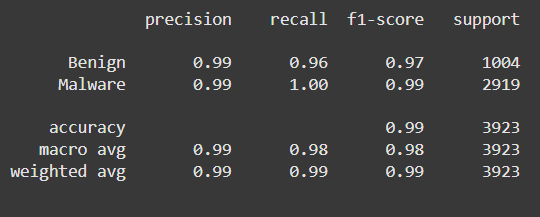

# Ex.No: 13 mini project-Malware detction with machine learning.
### DATE: 11.11.2024                                                                           
### REGISTER NUMBER : 212222060233
### AIM: 
To write a program to train the malware detection model.
###  Algorithm:
####
1. Collect and preprocess malware and benign data.  
2. Extract distinguishing features.  
3. Label and split the dataset.  
4. Select a suitable ML model.  
5. Train and tune the model.  
6. Evaluate with relevant metrics.  
7. Deploy and monitor for updates.

### Program:
```python
import numpy as np # linear algebra
import pandas as pd # data processing, CSV file I/O (e.g. pd.read_csv)
import pickle
import seaborn as sns
import matplotlib.pyplot as plt
from sklearn.ensemble import RandomForestClassifier
from sklearn.model_selection import train_test_split
from sklearn.metrics import classification_report, confusion_matrix
import os
for dirname, _, filenames in os.walk('/kaggle/input'):
    for filename in filenames:
        print(os.path.join(dirname, filename))
plt.style.use('ggplot')

data = pd.read_csv('/content/dataset_malwares.csv')

data.head()

data.info()

used_data = data.drop(['Name', 'Machine', 'TimeDateStamp', 'Malware'], axis=1)

plt.figure(figsize=(8, 6))
ax=sns.countplot(data['Malware'])
ax.set_xticklabels(['Benign', 'Malware'])

features = ['MajorSubsystemVersion', 'MajorLinkerVersion', 'SizeOfCode', 'SizeOfImage', 'SizeOfHeaders', 'SizeOfInitializedData', 
           'SizeOfUninitializedData', 'SizeOfStackReserve', 'SizeOfHeapReserve', 
            'NumberOfSymbols', 'SectionMaxChar']
i=1

for feature in features:
    plt.figure(figsize=(10, 15))
    ax1 = plt.subplot(len(features), 2, i)
    sns.distplot(data[data['Malware']==1][feature], ax=ax1, kde_kws={'bw': 0.1})
    ax1.set_title(f'Malware', fontsize=10)
    ax2 = plt.subplot(len(features), 2, i+1)
    sns.distplot(data[data['Malware']==0][feature], ax=ax2, kde_kws={'bw': 0.1})
    ax2.set_title(f'Benign', fontsize=10)
    i= i+2

X_train, X_test, y_train, y_test = train_test_split(used_data, data['Malware'], test_size=0.2, random_state=0)

print(f'Number of used features is {X_train.shape[1]}')

rfc = RandomForestClassifier(n_estimators=100, random_state=0, 
                         oob_score = True,
                         max_depth = 16)
rfc.fit(X_train, y_train)

y_pred = rfc.predict(X_test)

print(classification_report(y_test, y_pred, target_names=['Benign', 'Malware']))
```

### Output:



### Result:
Thus the system was trained successfully and the prediction was carried out.
